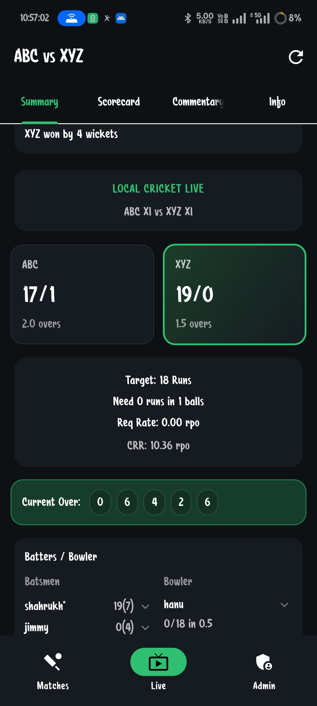
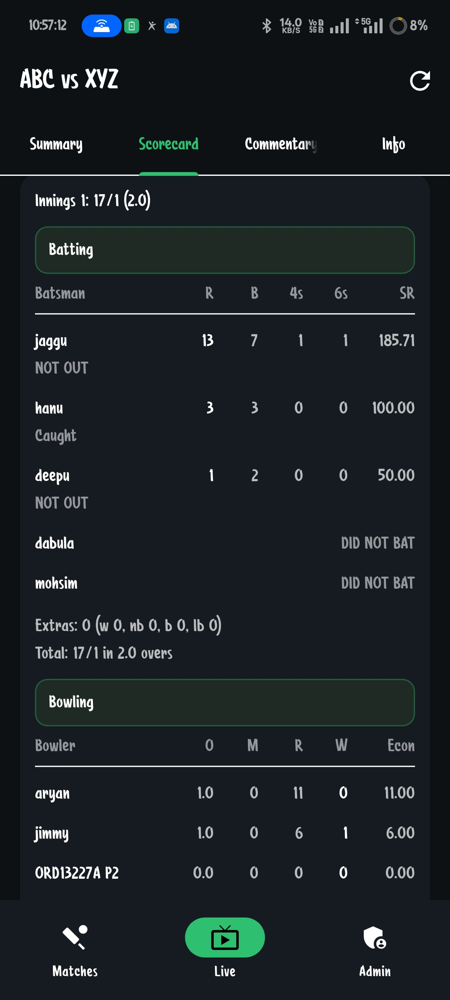
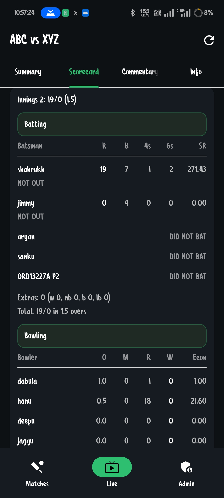
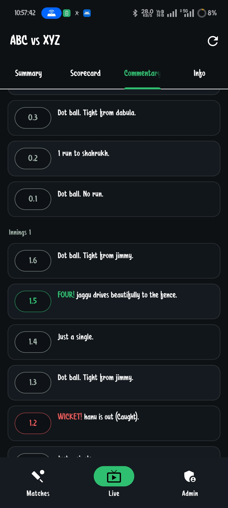
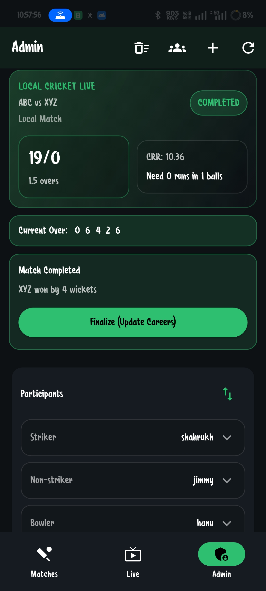

👉 Built a real-time match tracking system with dynamic state updates and live score rendering.

# Live Cricket Scoreboard

Real-time cricket scoring infrastructure for local matches, with live score rendering, match-state tracking, ball-by-ball updates, and an admin scoring workflow designed for fast, reliable in-game operation.

## Live Demo

Public demo link coming soon.

## Overview

Live Cricket Scoreboard is a production-style real-time scoring system built to keep viewers, scorers, and match organizers in sync without manual refresh. The platform handles live innings state, score progression, commentary, player participation, and derived match metrics in real time through a connected frontend and backend architecture.

This showcase repository presents the product, architecture, and UI experience without exposing private source code or operational secrets.

## Features

- Real-time live score updates powered by WebSocket-based event delivery
- Dynamic match-state tracking across innings, overs, wickets, target, and result progression
- Ball-by-ball scoring workflow for runs, extras, wickets, striker, bowler, and over state
- Live summary view with current over, run rate, required rate, and balls remaining
- Full scorecard support for batting, bowling, extras, and did-not-bat states
- Match commentary feed that updates as scoring events are recorded
- Team and player data management for match squads and reusable player profiles
- Admin scoring panel for updating matches securely during play
- Career-stat aggregation for players across matches
- Configurable local match setup with flexible overs and squad sizes

## Tech Stack

### Frontend

- Flutter
- Dart
- `http`
- `web_socket_channel`
- `shared_preferences`

### Backend

- Python 3
- Django 5
- Django REST Framework
- Django Channels
- Daphne
- Redis / `channels-redis`
- PostgreSQL
- SimpleJWT authentication

### Deployment

- Render configuration for web service, background worker, Redis, and PostgreSQL

## Screenshots

### Live Summary

### Scorecard

### Commentary

### Admin Panel

## How It Works

1. A scorer creates or opens a match and manages live events from the admin interface.
2. Each ball event is sent to the backend through authenticated API requests.
3. The backend computes derived state such as totals, wickets, over progress, run rate, required rate, balls remaining, and scorecard updates.
4. Updated match data is broadcast through Django Channels over WebSocket connections.
5. Viewer clients receive those events and re-render the live summary, scorecard, and commentary in real time.
6. Match completion triggers result state updates and downstream stat aggregation for players.

## Challenges Solved

- Real-time consistency between scoring actions and viewer-facing match screens
- Centralized match-state computation so frontend clients stay lightweight and accurate
- Correct handling of innings flow, extras, wickets, overs, and derived scoring metrics
- Low-friction live updates without requiring manual refresh from users
- Synchronizing commentary, scorecard, and summary views from the same live event stream
- Supporting flexible local-cricket match formats instead of hard-coding one scoring model

## Security And Product Readiness

- JWT-protected admin actions
- Production-oriented backend split between web and worker processes
- Redis-backed real-time event distribution
- PostgreSQL-backed persistent match and player data
- Public showcase repo with no secrets, environment files, or credentials committed

## Future Improvements

- Public live demo environment with sample matches
- Historical match archive and searchable fixtures
- Richer player analytics and performance dashboards
- Push notifications for wickets, milestones, and result events
- Multi-admin conflict handling and scorer session controls
- Role-based access for organizers, scorers, and viewers
- Web dashboard for tournament-level operations and reporting

## Repository Scope

This repository is a public-facing showcase for the product. It includes documentation and UI previews, while the private application code and deployment credentials are intentionally excluded.
